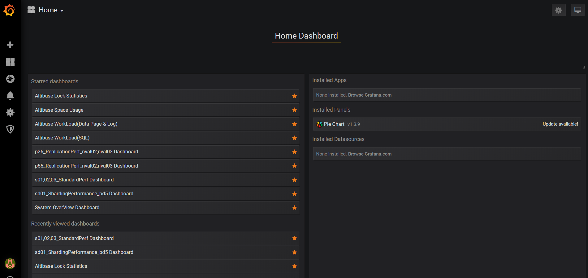
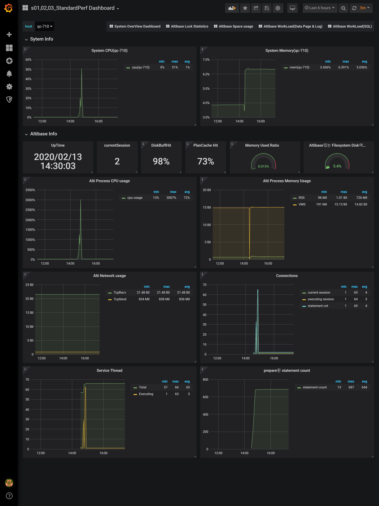
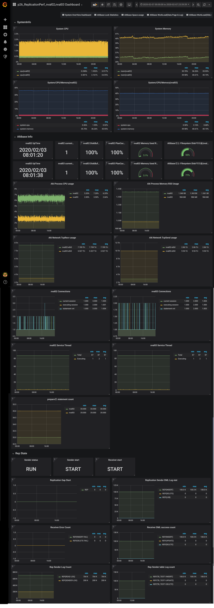
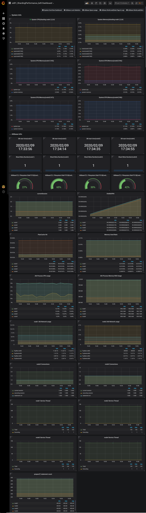
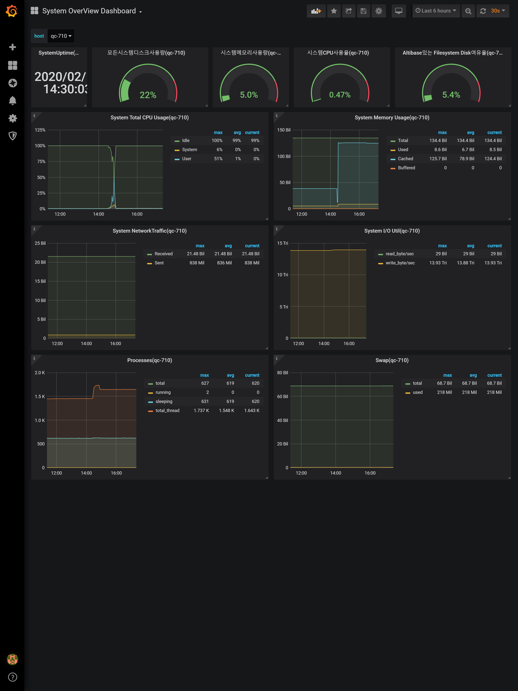
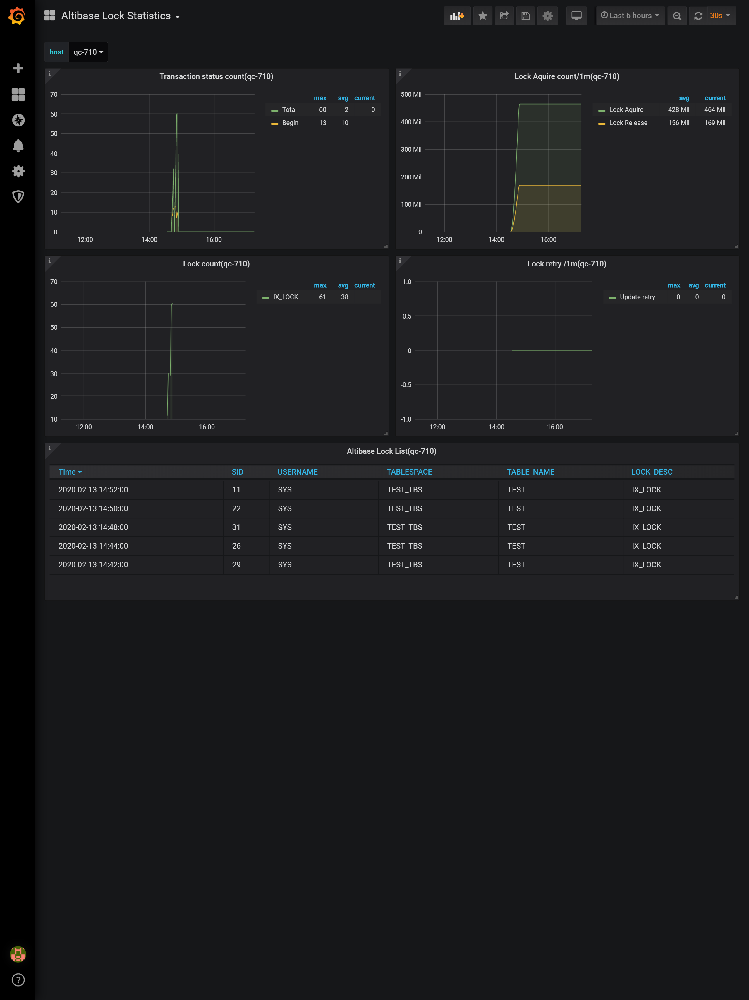
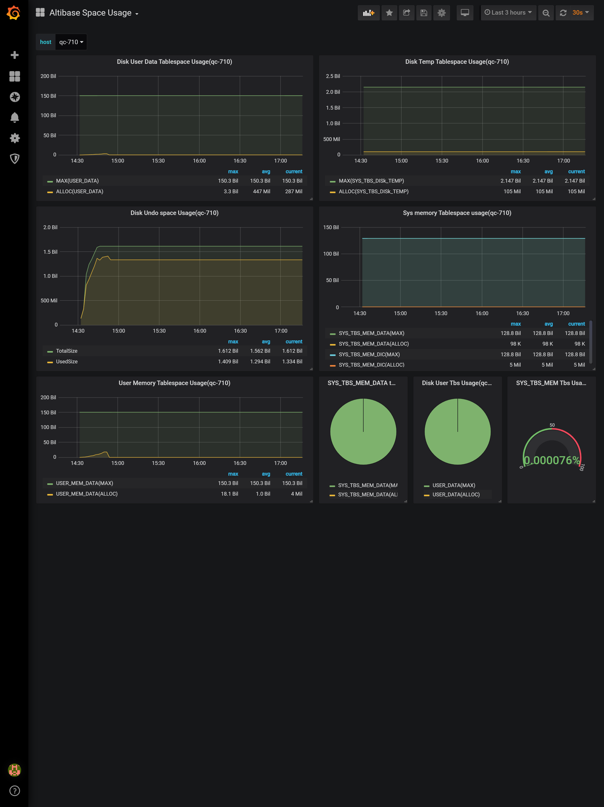
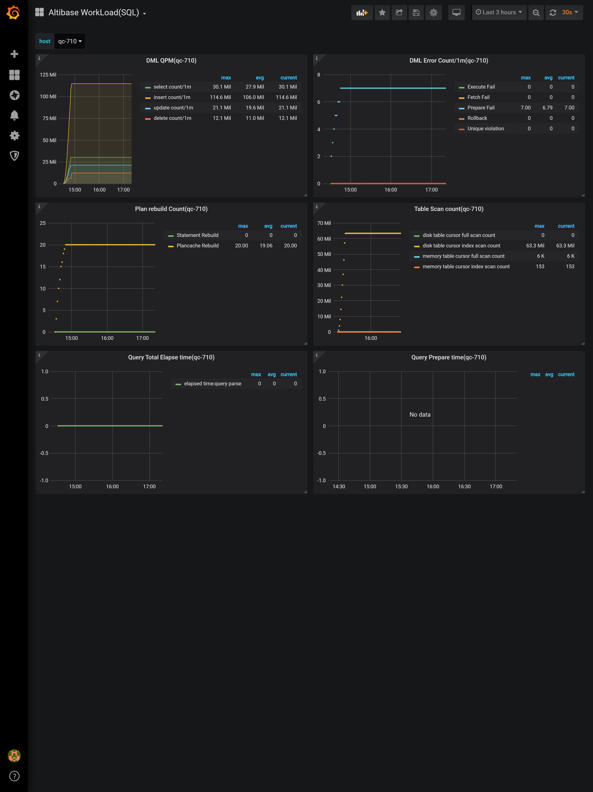
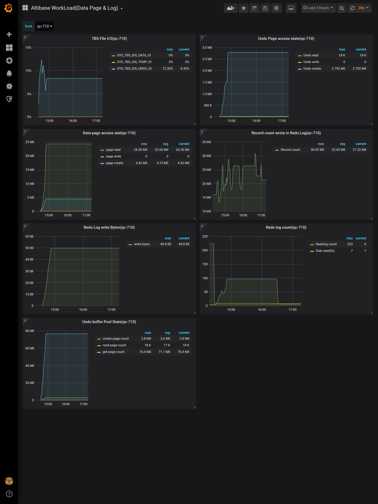

## Altibase-Cluster-Monitoring-System(ACMS)
ACMS(Altibase Cluster Monitoring System) is a graphical monitoring system for ALTIBASE or mutiple ALTIBASEs.

It is built with open sources of InfluxDB, Telegraf, and Grafana.

## Method to run package(패키지 수행 방법)
1.Pull docker image (docker 이미지 pull)

2.Run shell script (shell 스크립트 수행)
## Docker image
### 1.pull ACMS image(ACMS pull 하기)
Image repository: https://hub.docker.com/repository/docker/altibaseams/altiams
```
> docker pull altibaseams/altiams
> docker run --name influxDB_WITH_Grafana -d -p 8086:8086 -p 8083:8083 -p 3000:3000 -p 4000:4000 altibaseams/altiams
```
### 2.run Telegraf(Telegraf 수행)
ODBC should be installed in advance.

http://docs.altibase.com/pages/viewpage.action?pageId=11698380
#### download Telegraf source to Monitoring server(Monitoring 할 장비에서 Telegraf 소스 download)
```
> git clone https://github.com/ALTIBASE/Altibase-Cluster-Monitoring-System.git
```
#### modify Telegraf source(Telegraf 소스 수정)
```
go to telegraf directory and modify influxdb uri,altibase uri,and port information.
(telegraf directory에 들어 가서 influxdb uri, altibase uri,port 정보를 맞춰서 수정 합니다.)
 
a. telegraf.conf
[[outputs.influxdb]] urls = ["http://127.0.0.1:8086"] =>http://ipinfluxdb:portinfluxdb

hostname = "nval02(receiver)"

[[inputs.altibase]] altibase_dsn = "Altiodbc" => ODBC setting
altibase_server = "127.0.0.1"
altibase_port = 43019
altibase_user = "sys"
altibase_password = "manager"

[[inputs.exec]] commands = [ "/home1/perf/work/ams/telegraf_altibase/checkdir.sh" ]


b. test.go
mysrv = flag.String("mysrv", "127.0.0.1", "altibase server ip")
mydb = flag.String("mydb", "mydb", "altibase database name")
myuser = flag.String("myuser", "sys", "altibase user name")
mypass = flag.String("mypass", "manager", "altibase password")
myport = flag.String("myport", "43019", "altibase port")


c. altibase.go
mysrv = flag.String("mysrv", "127.0.0.1", "altibase server ip")
mydb = flag.String("mydb", "mydb", "altibase database name")
myuser = flag.String("myuser", "sys", "altibase user name")
mypass = flag.String("mypass", "manager", "altibase password")
myport = flag.String("myport", "43019", "altibase port")
```
#### run Telegraf(Telegraf 수행)
```
> nohup telegraf -config telegraf.conf &
```
### 3. connect Grafana Web(Grafana Web접속)
```
http://ipgrafana:portgrafana
```
#### Grafana Query 수정
```
Modify hostname to Grafana Graph Query(grafana graph query마다 hostname을 확인 합니다.)
check the host information as hostname you set in telegraf.conf
(telegraf.conf에서 세팅 해던 hostname로 수정해야 그 장비의 정보가 나옵니다.)
```
## Shell Script
set jq in /usr/bin/(수행하기전에 jq 세팅 하세요.  /usr/bin밑에서 저장하면 됩니다.)
jq수행 파일이 createDashboard Directory안에 들어 있습니다.

### 1.check out shell script 
```
> git clone https://github.com/ALTIBASE/Altibase-Cluster-Monitoring-System.git
```
### 2.run shell script
```
go to crateDashbord directory and run with root account
(crateDashboard Directory에 들어 가서 root권한으로 수행 합니다.)

a. Redhat
> sh influxdbgrafana_redhat.run [--ipgrafana=IP] [--portgrafana=PORT] [--ipinfluxdb=IP] [--portinfluxdb=PORT] [--help]
 
b. Ubuntu
> sh influxdbgrafana_ubuntu.run [--ipgrafana=IP] [--portgrafana=PORT] [--ipinfluxdb=IP] [--portinfluxdb=PORT] [--help]
 
###############################################################################################
# 1. install influxdb                                                                         #
# 2. install grafana                                                                          #
# 3. import dashboard                                                                         #
#                                                                                             #
#--ipgrafana=IP        If no --ipgrafana option is given, the default value is 127.0.0.1      # 
#--portgrafana=PORT    If no --portgrafana option is given, the default value is 3000         #  
#--ipinfluxdb=IP       If no --ipinfluxdb option is given, the default value is 127.0.0.1     #
#--portinfluxdb=PORT   If no --portinfluxdb option is given, the default value is 8086        #   
###############################################################################################
```
### 3.run Telegraf(Telegraf 수행)
see "Docker image > 2. Telegraf
("Docker image" 2번 telegraf 수행 참고.)
### 4.connect Grafana Web(Grafana Web접속)
see "Docker imange > 3. Grafana Web
("Docker image" 3번 grafana web접속 참고.)

## Telegraf 수집하는 정보가 다음과 같습니다.
telegraf Directory에 query.toml 파일이 있습니다.
query.toml 파일에 모든 수집 정보의 query가 기록되어 있으니 참고하세요.
### Altibase Info
- alti_diskusage_mycollector
- alti_lockobj_list
- alti_locktable_stat
- alti_longrunsql_count
- alti_repgap_stat
- alti_reprecv_stat
- alti_repsender_info
- alti_repsender_log_stat
- alti_repsender_start_stat
- alti_repsender_stat
- alti_repsender_tblog_stat
- alti_sysstat
- alti_tbs_usage
- alti_tbsfileIO_stat
- alti_tx_count
- alti_undobuff_stat
- altibase_basic_info
- altibase_buffhit_stat
- altibase_mem_stat
- altibase_plancache_stat
- altibase_session_stat
- altibase_srv_stat
### System Info
- cpu
- disk
- diskio
- kernel
- mem
- net
- processes
- procstat
- swap
- system

## Screenshot
### 1.Home


### 2.Performance


### 3.Replication


### 4.Sharding Cluster System


### 5.System Overview


### 6.Altibase Lock Statistics


### 7.Altibase Space


### 8.Altibase Workload


### 9.Altibase Workload Data Page

